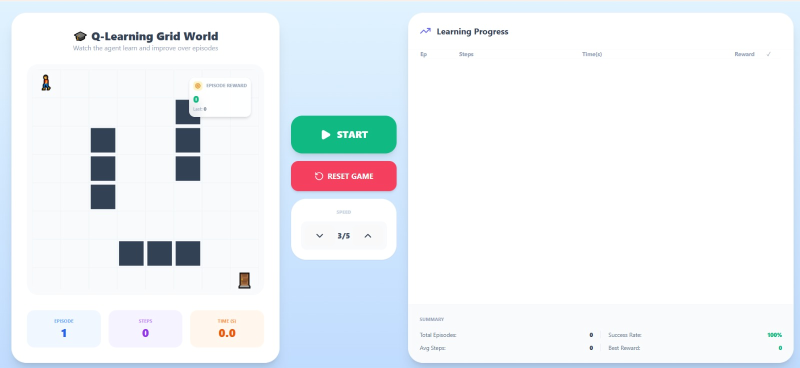
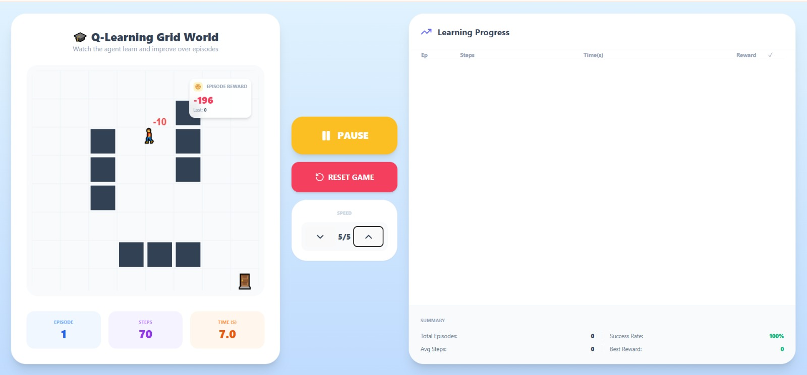
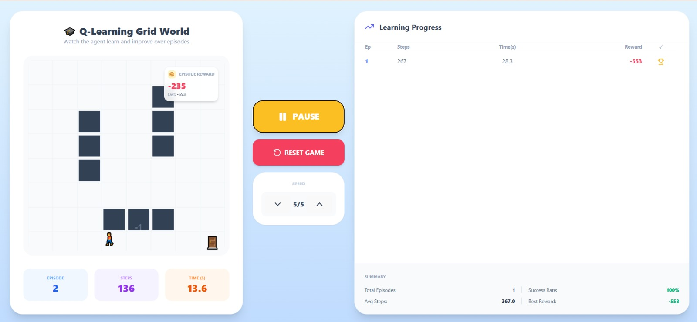
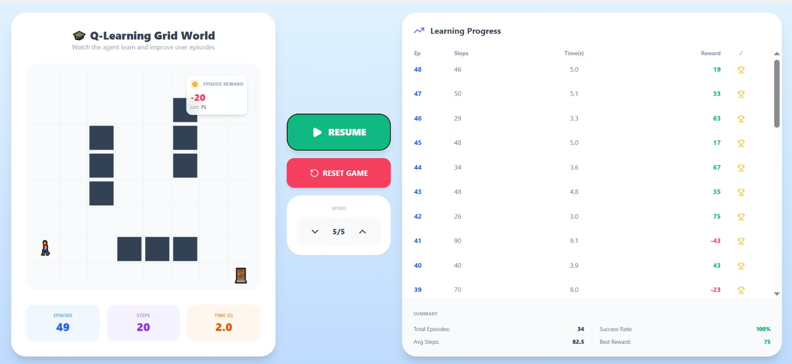
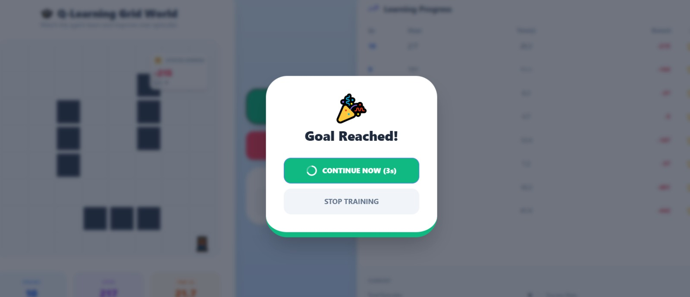
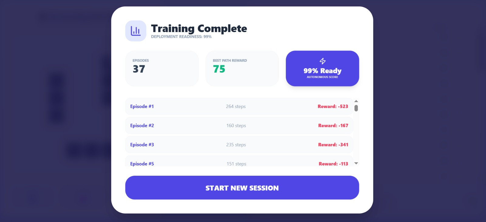

# 🎓 Q-Learning Grid World — Interactive RL Pathfinding

## 🧩 Description
This project is an interactive Reinforcement Learning (RL) simulation built with React and Tailwind CSS. It features an agent that utilizes the **Q-Learning algorithm** to navigate an $8 \times 8$ grid, avoiding obstacles and penalties to reach a goal. The project includes a modern UI with real-time performance tracking, floating reward animations, and a unique **"Real-World Readiness"** assessment logic that calculates when the agent is stable enough for deployment based on its learning history.

---

## 📁 Project Structure
- `src/`
  - `GridWorldRL.jsx` — The core engine: contains the Q-table logic, the game loop, and the UI components.
  - `App.js` — Main entry point for the React application.
  - `index.css` — Global styles and Tailwind CSS configurations.
- `package.json` — Project dependencies (`lucide-react`, `tailwindcss`, `react`).
- `README.md` — This documentation file.

---

## 🏗️ Core Logic & Features

### 🧠 The Learning Engine — `GridWorldRL.jsx`
The agent uses a **Temporal Difference (TD)** update rule to learn the value of actions ($a$) in specific states ($s$).
- **Algorithm:** Q-Learning
- **State Space:** $8 \times 8$ Grid coordinates
- **Action Space:** Up, Down, Left, Right
- **Parameters:** Learning Rate ($\alpha$) = 0.1, Discount Factor ($\gamma$) = 0.9, Epsilon ($\epsilon$) = 0.2 (Exploration)

### 📊 Live Statistics Dashboard
As the agent runs, the system tracks and displays:
- **Episode Counter:** Sequential numbering (1, 2, 3...).
- **Step Counter:** Real-time movement tracking (1, 2, 3...).
- **Reward Badge:** Floating icons showing $+100$ for goals, $-1$ for steps, and $-10$ for walls.
- **Learning Progress Table:** A historical log of every finished episode including time and total reward.

---

## ⚙️ Requirements & Setup

### ⚙️ Environment Requirements
Before running the project, ensure you have:
- **Node.js** (v16.0+)
- **npm** or **yarn**

### 📦 Install Dependencies
Clone the repository and install the required UI and icon libraries:
```bash
npm install lucide-react tailwindcss lucide-react
```
## 🚀 Running the Game
To start the development server, run the following command in your terminal:
```bash
npm start
```
---

## 📈 Learning Performance & Deployment

### 🧹 Summary Statistics
The **Learning Progress** section provides a live summary of the agent's growth:
* **Success Rate**: Percentage of goals reached (currently **100%** in controlled environments).
* **Avg Steps**: The average number of moves required to reach the door across all episodes.
* **Best Reward**: The highest score achieved in a single episode.

### 🛡️ Deployment Readiness Assessment
When the user stops the training, a final window appears calculating **Real-World Readiness**.

| Metric | Logic |
| :--- | :--- |
| **Stability** | Consistency of rewards over the last 5 episodes. |
| **Efficiency** | Reduction in total steps compared to Episode 1. |
| **Readiness Score** | Calculated between **0% – 99%** based on cumulative performance. |

✅ **Result:** Once the score exceeds **80%**, the agent is considered **"Ready"** for autonomous navigation in similar static environments.

---

## 🎮 Interface Highlights

### 🕹️ Controls & Speed
* **Start/Pause/Resume**: Provides full control over the reinforcement learning loop.
* **Speed Slider (1-5)**: Allows users to slow down for detailed observation or speed up for rapid training.
* **Reset**: Clears the Q-table and history to start the learning process from scratch.

### 🖼️ Screenshots & Evolution

| | |
| :---: | :---: |
|  |  |
|  |  |
|  | |
|  | |

---

#### 📂 Image Descriptions:
* **11, 22, 33, 55.jpeg**: These images capture the grid and the agent's pathfinding evolution as it learns to find the optimal path over several episodes.
* **44.jpeg**: This shows the "Goal Reached" interface, including the 5-second circular countdown timer and the option to continue training.
* **66.jpeg**: This is the final "Training Session Complete" window, displaying the Deployment Readiness score and the summary of all episodes.

---

## 💡 Tips for High Scores
To achieve a **99% Readiness Score**:
1. **Patience**: Let the agent run for at least **20 episodes** to stabilize its policy.
2. **Speed**: Increase the speed to **5/5** to allow the Q-table to populate faster.
3. **Observation**: Monitor the **"Steps"** count; when it stops decreasing and stays consistent, the agent has found the optimal path!.

